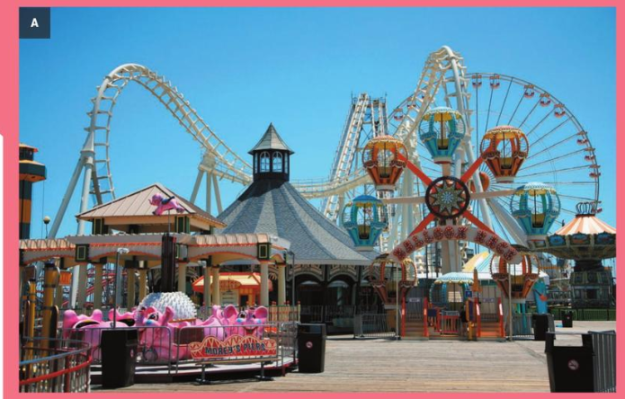

# Energy in a Theme Park

There are a lot of things happening in a theme park. Almost everything that happens involves energy in some way. For example, your body needs energy to stay alive, and to allow you to move around. Energy is needed to make all the rides in the theme park work. The energy needed is stored in food and in fuels, such as petrol.

---

## **1. Which of the rides shown in photo A needs the most energy and which the least energy? Explain your answers.**

____________________________________________________________________________________

____________________________________________________________________________________

____________________________________________________________________________________

---

## **2.**  
**a) Write down five different things that are happening in photos A and B that need energy.**

1. __________________________________________________________________________
2. __________________________________________________________________________
3. __________________________________________________________________________
4. __________________________________________________________________________
5. __________________________________________________________________________

**b) How is energy provided for these things to happen?**

____________________________________________________________________________________

____________________________________________________________________________________

____________________________________________________________________________________

---

## **3.**  
**a) Write down five things you did yesterday that needed energy.**

1. __________________________________________________________________________
2. __________________________________________________________________________
3. __________________________________________________________________________
4. __________________________________________________________________________
5. __________________________________________________________________________

**b) Which of these things do you think needed the most energy, and which needed the least energy? How do you know?**

____________________________________________________________________________________

____________________________________________________________________________________

____________________________________________________________________________________

---

> *Note: Since photos A and B are not provided, answers to questions referencing them should be based on typical theme park observations (e.g., roller coasters, carousels, food stalls, lighting, sound systems, etc.).*